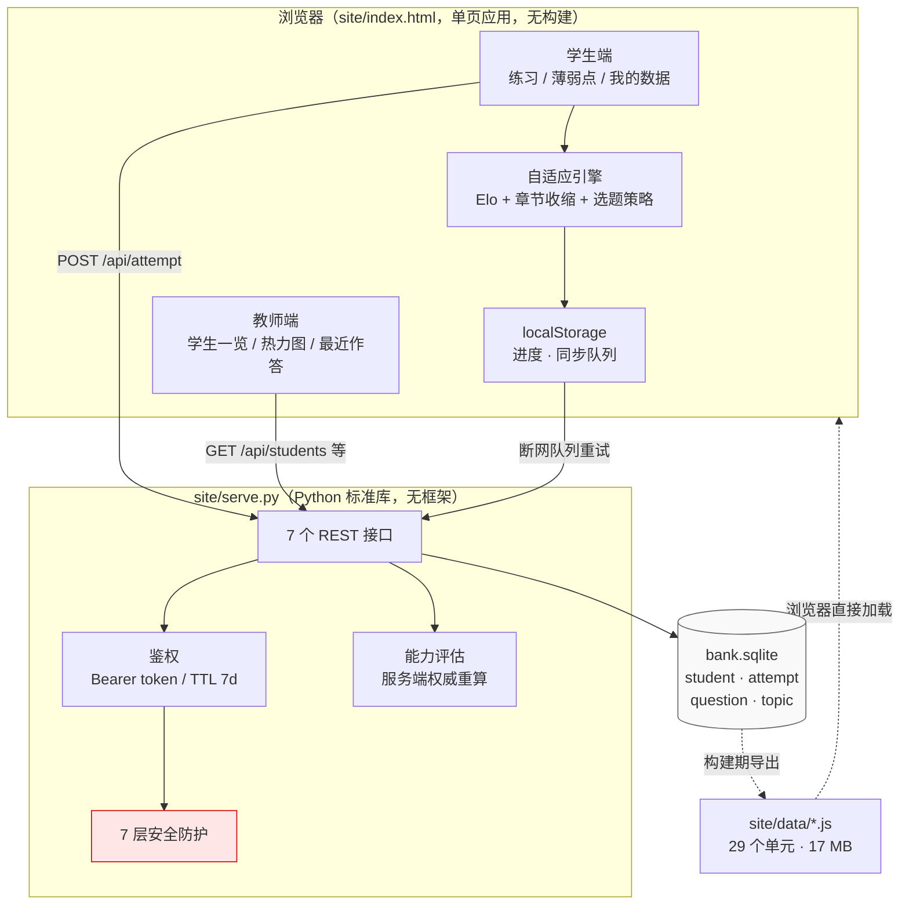

# 数学题库系统 · Math Bank

> 面向国际课程（A-Level / IAL / 竞赛）的**自适应习题与学情系统**。
> 12,030 道真题、29 个考试单元、1,009 个知识点，跑在老师自己的电脑上，**学生数据不出本机**。


---

## ⚠️ 先读这段：版权与数据

本仓库只公开**代码**与**结构化元数据**（题干文本、知识点、难度、分值、出处年份）。

**原卷图片（31,532 张 PNG，2.9 GB）不在本仓库**，原因有二：

1. **版权** —— 真题与 Mark Scheme 属剑桥 CAIE、培生 Edexcel、UKMT 等考试局所有，不适合公开分发；
2. **体积** —— 2.9 GB 远超 GitHub 免费账号的合理容量（Git LFS 免费额度仅 1 GB）。

图片存放于本地独立版本库 `site/data/img/`（已被 `.gitignore` 排除），
本项目在无图环境下**仍可正常运行**，只是题目不显示原卷截图，改以文字题干呈现。

> 📌 若你是仓库所有者并需要把图片用于课堂教学，请确认你已获得相应考试局的授权，
> 或仅使用已获授权的样卷（Specimen Paper）。

---

## ✨ 特性

### 学生端

| 功能 | 说明 |
|---|---|
| **自适应出题** | 每轮 10 题，按 `60% 补短板 / 25% 间隔重复 / 15% 拔高` 配比选题 |
| **能力评估** | Elo 变体 + 章节收缩，逐知识点给出能力分与可信度 |
| **公式渲染** | KaTeX 本地内置（离线可用，不依赖 CDN） |
| **原卷截图** | 题干以原卷图主显，文字版折叠（OCR 有残损时以图为准） |
| **客观题自动判分** | 选择题点选后即时判定对错 |
| **主观题自评** | 按"实际做到哪一步"自评，并**必填错因**（七类） |
| **答后订正** | 提交后对照 Mark Scheme / 参考答案订正 |
| **薄弱点视图** | 按能力分排序的条形图，标注样本是否充足 |
| **断点续做** | 刷新页面可恢复未完成的一轮（2 小时内有效） |

### 教师端

| 功能 | 说明 |
|---|---|
| **学生一览** | 花名册 + 题量、正确率、最近活跃、最弱 3 个知识点 |
| **掌握热力图** | 学生 × 知识点 的能力分矩阵，一眼看出全班共性薄弱点 |
| **一键出卷** | 按某学生的薄弱知识点生成专项练习 HTML（含答案/细则） |
| **最近作答** | 全班作答流水，可按错因筛选 |
| **导出** | JSON 导出（教师全员 / 学生仅本人） |

### 工程特性

- **零运行时依赖**：后端只用 Python 标准库，前端无框架、无构建步骤
- **零 LLM 调用**：判分、评估、反馈全部是确定性代码，可复现、可解释
- **数据不出本机**：本机运行时只监听 `127.0.0.1`，作答写入本地 SQLite
- **七层安全防护**：Host 白名单 / 静态文件黑名单 / CSP / 同源校验 / 限流 / 输入校验 / 版本隐匿
- **离线可用**：KaTeX 与题库数据全部本地化

---

## 🚀 快速开始

### 方式一：本地服务（推荐）

作答写入 `bank.sqlite`，换设备、换浏览器都不丢。

```bash
git clone https://github.com/WEIWEI0614/math-bank.git
cd math-bank

python3 site/serve.py          # → http://127.0.0.1:8770
python3 site/serve.py --port 9000   # 换端口
```

首次启动会打印教师口令与学生班级码：

```
练习站: http://127.0.0.1:8770/   （仅本机可访问，数据写入 /path/to/bank.sqlite）
教师口令: shuxue2026   学生班级码: banji2026
```

> 生产环境请务必改掉默认口令 —— 用环境变量 `TEACHER_KEY` / `STUDENT_CODE` 覆盖，
> 或改写仓库根目录的 `.teacher_key` / `.student_code`（均为 0600 权限，已被 git 忽略）。
> 优先级：**环境变量 > 密钥文件 > 内置默认值**。

### 方式二：直接打开（无后端）

双击 `site/index.html` 即可。数据存在浏览器 `localStorage`，**换设备即丢失**，适合单机自用。

```bash
open site/index.html
```

### 登录

| 角色 | 需要 | 说明 |
|---|---|---|
| 学生 | 姓名 + 班级码 | 首次登录自动建号 |
| 教师 | 教师口令 | 可看全班数据、出卷、导出 |

会话为 Bearer token，TTL 7 天，存于 `localStorage`。

---

## 📊 题库覆盖

**合计：29 单元 · 12,030 题 · 1,009 知识点 · 230 章 · 年份 1993–2026**

| 体系 | 单元 | 题量 | 知识点 | 章 |
|---|---:|---:|---:|---:|
| **CIE 9709** A-Level 数学 | 7 | 5,832 | 125 | 54 |
| **Edexcel IAL** 国际 A-Level | 14 | 3,443 | 345 | 97 |
| **竞赛 / 入学考** | 4 | 1,539 | 509 | 49 |
| **CIE 9231** 进阶数学 | 4 | 1,216 | 30 | 30 |

<details>
<summary><b>展开：29 个单元明细</b></summary>

| 代码 | 名称 | 题量 | 知识点 | 章 |
|---|---|---:|---:|---:|
| CIE9709P1 | CIE 9709 P1 纯数1 | 1,225 | 40 | 10 |
| CIE9709P3 | CIE 9709 P3 纯数3 | 1,212 | 17 | 10 |
| CIE9709S1 | CIE 9709 S1 统计1 | 778 | 26 | 9 |
| CIE9709M1 | CIE 9709 M1 力学 | 776 | 20 | 6 |
| CIE9709P2 | CIE 9709 P2 纯数2 | 725 | 7 | 4 |
| CIE9709S2 | CIE 9709 S2 统计2 | 660 | 8 | 8 |
| CIE9709M2 | CIE 9709 M2 力学2 | 456 | 7 | 7 |
| EDXIALS2 | Edexcel IAL S2 统计2 | 349 | 18 | 6 |
| EDXIALFP1 | Edexcel IAL FP1 进阶1 | 336 | 32 | 9 |
| EDXIALS1 | Edexcel IAL S1 统计1 | 316 | 15 | 6 |
| EDXIALD1 | Edexcel IAL D1 决策1 | 297 | 19 | 6 |
| EDXIALM1 | Edexcel IAL M1 力学1 | 276 | 16 | 7 |
| EDXIALM2 | Edexcel IAL M2 力学2 | 276 | 14 | 5 |
| EDXIALP2 | Edexcel IAL P2 纯数2 | 228 | 19 | 8 |
| EDXIALFP2 | Edexcel IAL FP2 进阶2 | 223 | 26 | 9 |
| EDXIALP1 | Edexcel IAL P1 纯数1 | 219 | 78 | 9 |
| EDXIALFP3 | Edexcel IAL FP3 进阶3 | 206 | 22 | 7 |
| EDXIALS3 | Edexcel IAL S3 统计3 | 205 | 20 | 6 |
| EDXIALP3 | Edexcel IAL P3 纯数3 | 190 | 18 | 7 |
| EDXIALP4 | Edexcel IAL P4 纯数4 | 175 | 33 | 7 |
| EDXIALM3 | Edexcel IAL M3 力学3 | 147 | 15 | 5 |
| SMC | UKMT SMC 高级数学挑战赛 | 725 | 76 | 2 |
| TMUA | TMUA 入学考数学 | 360 | 335 | 15 |
| ESAT | ESAT 入学考（ENGAA/NSAA） | 262 | 81 | 15 |
| BMO | BMO Round 1 英国数学奥赛 | 192 | 17 | 17 |
| CIE9231FP1 | CIE 9231 FP1 进阶纯数1 | 370 | 7 | 7 |
| CIE9231FM | CIE 9231 FM 进阶力学 | 315 | 9 | 9 |
| CIE9231FP2 | CIE 9231 FP2 进阶纯数2 | 273 | 8 | 8 |
| CIE9231FS | CIE 9231 FS 进阶统计 | 258 | 6 | 6 |

</details>

其他统计：客观题（带选项）1,178 道（9.8%）· 带图题 11,487 道（95.5%）。

---

## 🏗 架构



### 目录结构

```
.
├── site/
│   ├── index.html          单页应用（1,923 行，含全部前端逻辑与引擎，无构建步骤）
│   ├── serve.py            本地服务（标准库 http.server，零第三方依赖）
│   ├── vendor/katex/       KaTeX 本地副本（含 20 个 woff2 字体，离线可用）
│   └── data/
│       ├── index.js        单元索引（29 个单元的元信息）
│       └── <UNIT>.js       每个单元一个题库文件（共 17 MB）
├── docs/                   📖 完整文档（见下）
├── requirements.txt        仅构建脚本需要（PyMuPDF / Pillow / numpy）
├── Procfile / render.yaml  云部署配置
└── bank.sqlite            数据库（运行期生成，不进发布包）
```

---

## 🎓 自适应引擎

能力评估是一个 **Elo 变体**，不是 IRT —— 单学生样本量撑不起 IRT 的参数估计，而 Elo 冷启动即可用。

```js
const INIT = 1000, K_HI = 32, K_LO = 12;   // 初始分 / 早期 K / 稳定期 K
const MIN_T = 3,  SHOW_AT = 15;            // 最小样本 / 展示阈值
const SHRINK = 0.5;                        // 向同章兄弟节点收缩的权重
```

四条设计要点：

1. **Elo 式更新** —— 难度 `D = 800 + 800×(1 - difficulty_p)` 作为对手分；早期 `K=32` 快速收敛，样本够了降到 `K=12`
2. **超时降权** —— 超过 120 秒才做对的题只给 `0.7` 学分（速度是能力的独立维度）
3. **章节收缩** —— 某知识点样本不足 3 题时，向同章兄弟节点的加权均值收缩，避免"做过 1 题"就给出极端分
4. **样本提示** —— 样本 <3 显示"样本不足"，<15 显示"样本偏少"，**不显示能力分**

选题配比（每轮 10 题）：

| 类型 | 占比 | 策略 |
|---|---:|---|
| 补短板 | 60% | 取能力分最低的 3 个知识点 |
| 间隔重复 | 25% | 未用过的知识点 |
| 拔高 | 15% | 能力分 > 1150 的知识点 |

参数不是拍脑袋定的 —— 见 [docs/ADAPTIVE-ENGINE.md](docs/ADAPTIVE-ENGINE.md)，
里面有 5 个变体的 A/B 实测数据（AUC / 相关系数）与文献依据。

---

## 📖 文档

| 文档 | 内容 | 适合谁 |
|---|---|---|
| [docs/PRODUCT.md](docs/PRODUCT.md) | **产品手册** —— 教师与学生完整使用流程 | 使用者 |
| [docs/ARCHITECTURE.md](docs/ARCHITECTURE.md) | 架构设计、数据流、技术选型取舍 | 开发者 |
| [docs/ADAPTIVE-ENGINE.md](docs/ADAPTIVE-ENGINE.md) | 引擎算法、A/B 实验、文献依据 | 开发者 / 教研 |
| [docs/DATA-FORMAT.md](docs/DATA-FORMAT.md) | 题库数据格式规范（11 字段定长数组） | 想导入自己题库的人 |
| [docs/API.md](docs/API.md) | 7 个 HTTP 接口的完整说明 | 开发者 |
| [docs/DEPLOY.md](docs/DEPLOY.md) | 本机 / 局域网 / Render 云部署 | 运维 |
| [docs/SECURITY.md](docs/SECURITY.md) | 七层安全防护与威胁模型 | 审计者 |
| [docs/KNOWN-ISSUES.md](docs/KNOWN-ISSUES.md) | ⚠️ 已知数据缺陷（动手前必读） | 所有人 |

---

## 🔒 安全

本机模式默认只监听 `127.0.0.1`，并叠加 7 层防护：

| # | 措施 | 防御目标 |
|---:|---|---|
| 1 | Host 白名单 | DNS-rebinding |
| 2 | 静态文件扩展名黑名单（`.py` / `.sqlite` / `.env` + 拒绝 `..`） | 源码与数据库外泄 |
| 3 | 安全响应头（`nosniff` / `X-Frame-Options` / `Referrer-Policy` / CSP） | XSS · 点击劫持 |
| 4 | 同源写入校验（POST 带 origin 必须来自本机/同源） | 跨站伪造作答 |
| 5 | 限流 120 次/分钟/IP | 滥用 |
| 6 | 输入校验（body ≤ 64 KB，白名单正则，范围钳制） | 注入 · 越界 |
| 7 | 版本隐匿（`Server: mathbank`） | 指纹识别 |

角色隔离是**服务端强制**的：学生 token 无法导出全班数据，教师 token 不能作答。
详见 [docs/SECURITY.md](docs/SECURITY.md)。

---

## ⚠️ 已知缺陷

**动手前请先读 [docs/KNOWN-ISSUES.md](docs/KNOWN-ISSUES.md)。** 题库是从真题 PDF 自动抽取构建的，
数据侧有几个系统性缺陷，其中两个是 🔴 级：

**① 11.1% 的题目练不到** —— 1,331 题的 `topic_id` 在其所属单元的 `topics[]` 里不存在，
而出题逻辑只遍历 `topics[]`，导致这些题**永远不会被自适应出题选中**。

| 单元 | 总题 | 可练 | 不可达 |
|---|---:|---:|---:|
| CIE9709P2 | 725 | 223 | **69%** |
| EDXIALP2 | 228 | 120 | **47%** |
| SMC | 725 | 427 | **41%** |
| CIE9709P3 | 1,212 | 1,051 | 13% |
| 全库 | 12,030 | 10,699 | **11.1%** |

**② 答案文本有定长截断** —— 3,093 题（25.7%）的答案**恰好等于 1200 字符**，
是"从合并文档里切固定窗口"造成的，不是偶发抽错。
🔴 **不要拿答案文本做自动讲解或自动判分。**

其余缺陷（OCR 残损、图题错配、`pre` 字段仅 2.6% 非空等）共 11 项，
完整清单、影响与规避方式见 [docs/KNOWN-ISSUES.md](docs/KNOWN-ISSUES.md)。

跑 `python3 scripts/check_data.py` 可自行复现上述检查。

---

## 🛠 技术选型的取舍

| 决策 | 取 | 舍 | 理由 |
|---|---|---|---|
| 数据格式 | 定长数组 | 对象 | 省体积（12,030 题 × 11 字段） |
| 前端 | 单文件原生 JS | React / Vue | 无构建步骤，十年后还能跑 |
| 后端 | 标准库 `http.server` | Flask / FastAPI | 零依赖，不需要 venv |
| 判分 | 确定性代码 | LLM 判分 | 可复现、可解释、零成本、数据不出本机 |
| 公式 | 本地 KaTeX | CDN | 离线可用 |
| 部署 | 只拷 `site/` | 全目录 | 数据库与密钥不进发布包 |

---

## 🤝 贡献

见 [CONTRIBUTING.md](CONTRIBUTING.md)。

**特别提醒**：请勿向本仓库提交原卷图片、Mark Scheme 扫描件等受版权保护的材料 ——
这类 PR 会被直接拒绝。详见 CONTRIBUTING 中的"版权红线"。

---

## 📄 许可证

代码部分采用 **MIT License**（见 [LICENSE](LICENSE)）。

题库数据（题干文本、答案文本、知识点标签）来自公开的历年真题，
其著作权归原考试局（CAIE / Pearson Edexcel / UKMT）所有；
本仓库仅在教学自用范围内做结构化整理，**不包含任何原卷图片**。

---

<sub>如果这个项目对你有用，欢迎点个 ⭐。</sub>
